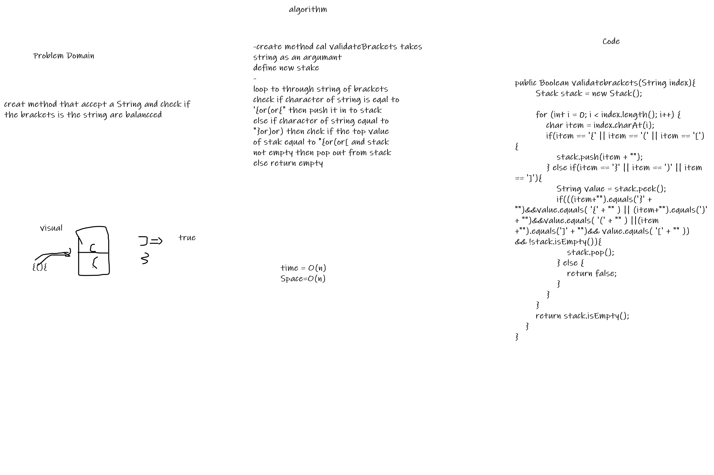

# Challenge Summary
<!-- Description of the challenge -->
Write a function called validate brackets takes a String as an Arguments representing whether or not the brackets in the string are balanced, There are 3 types of brackets:

Round Brackets : ()

Square Brackets : []

Curly Brackets : {}
## Whiteboard Process
<!-- Embedded whiteboard image -->

## Approach & Efficiency
<!-- What approach did you take? Why? What is the Big O space/time for this approach? -->
Big O time -> O(n) 

Big O space -> O(n) 

