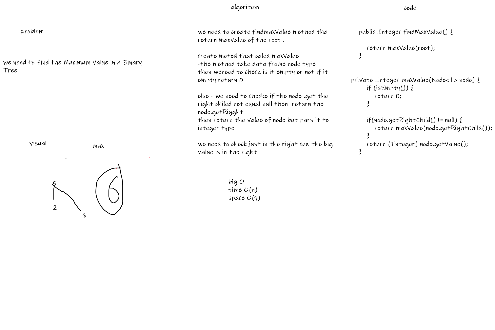

# Challenge Summary
<!-- Description of the challenge -->
Find the Maximum Value in a Binary Tree

## Whiteboard Process
<!-- Embedded whiteboard image -->

## Approach & Efficiency
<!-- What approach did you take? Why? What is the Big O space/time for this approach? -->
Big O space o(1) time O(n)

