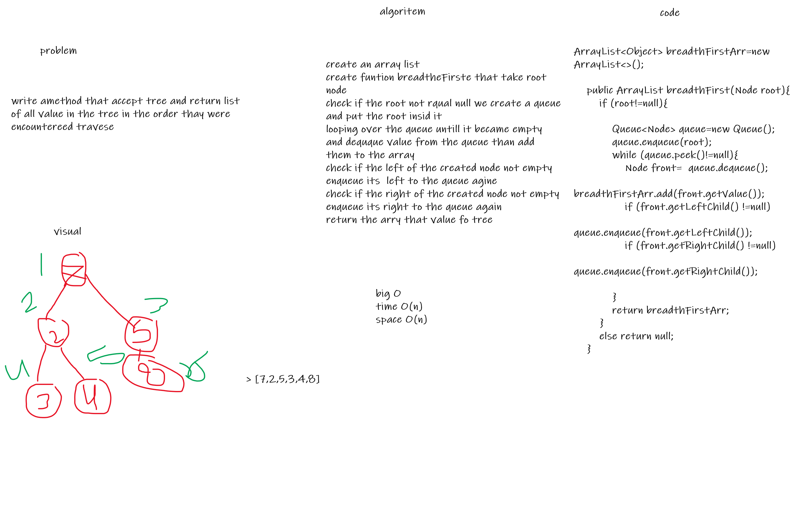

# Challenge Summary
<!-- Description of the challenge -->
Add method to the tree to handle the breadth first traverse level by level

## Whiteboard Process
<!-- Embedded whiteboard image -->

## Approach & Efficiency
<!-- What approach did you take? Why? What is the Big O space/time for this approach? -->
: time > O(n) , space > O(n)

