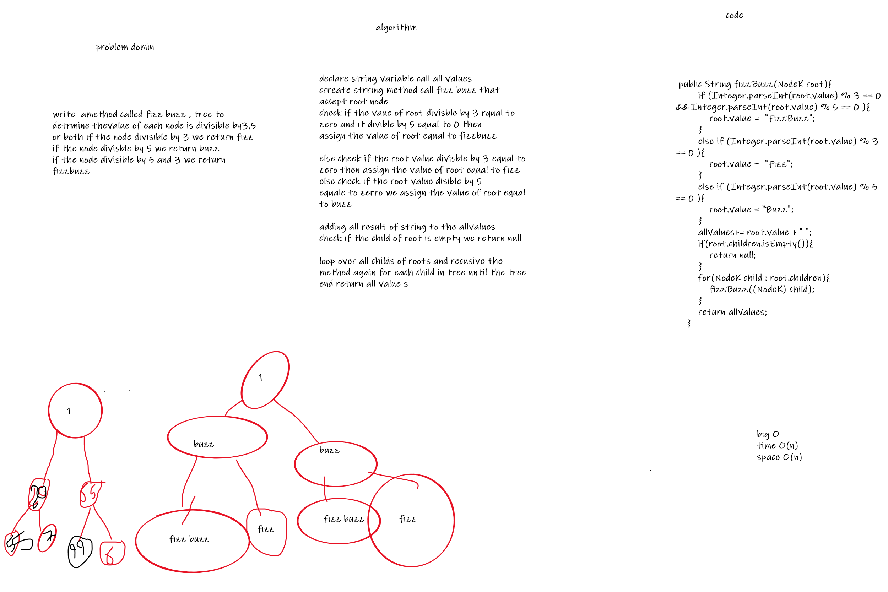

# Challenge Summary
<!-- Description of the challenge -->
Write a method called fizz buzz tree to determine whetheror not
the value of each node is divisible by 3, 5 or both. if the node
divisble by 3 we return Fizz if the node divisble by 5 we return Buzz if the node
divisble by 5 and 3 we return FizzBuzz

## Whiteboard Process
<!-- Embedded whiteboard image -->

## Approach & Efficiency
<!-- What approach did you take? Why? What is the Big O space/time for this approach? -->
: time > O(n) , space > O(n)

