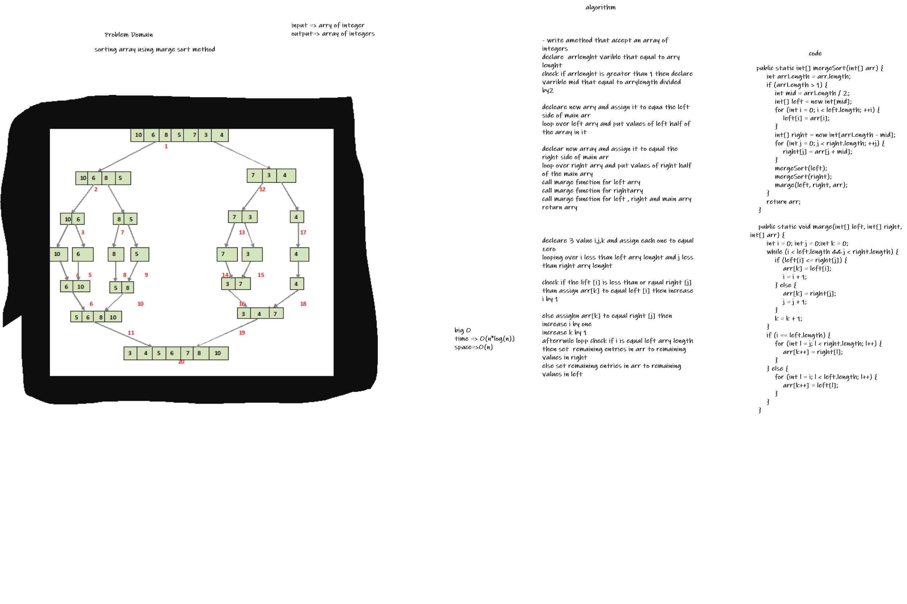

# Challenge Summary
<!-- Description of the challenge -->
sorting array using marge sort method
## Whiteboard Process
<!-- Embedded whiteboard image -->

## Approach & Efficiency
<!-- What approach did you take? Why? What is the Big O space/time for this approach? -->

## Solution
<!-- Show how to run your code, and examples of it in action -->
big O
time => O(n*log(n))
space=>O(n)
