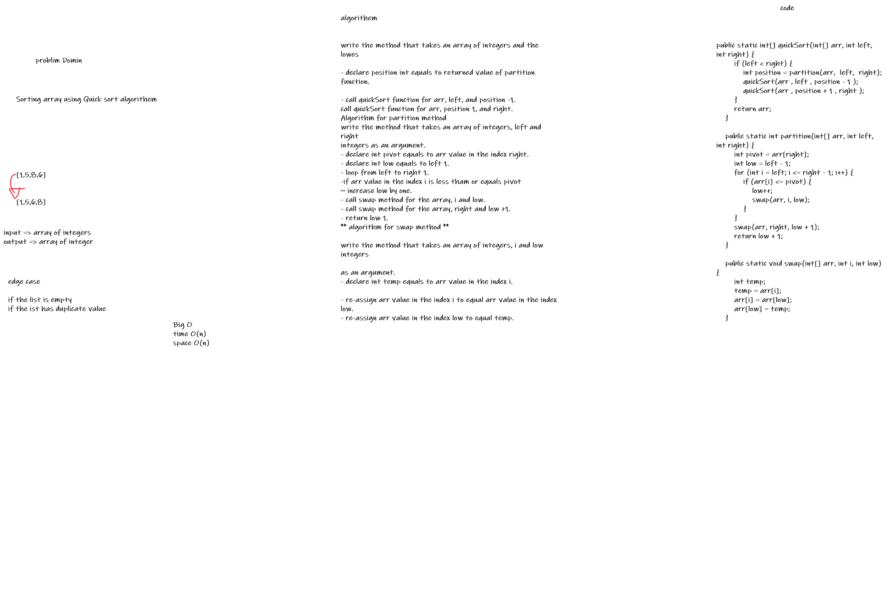

# Challenge Summary
<!-- Description of the challenge -->
Quick Sort
create method that take array of integers using Quick sort algorithm

## Whiteboard Process
<!-- Embedded whiteboard image -->

## Solution
<!-- Show how to run your code, and examples of it in action -->
big O
time => O(n log(n))
space=>O(n)
