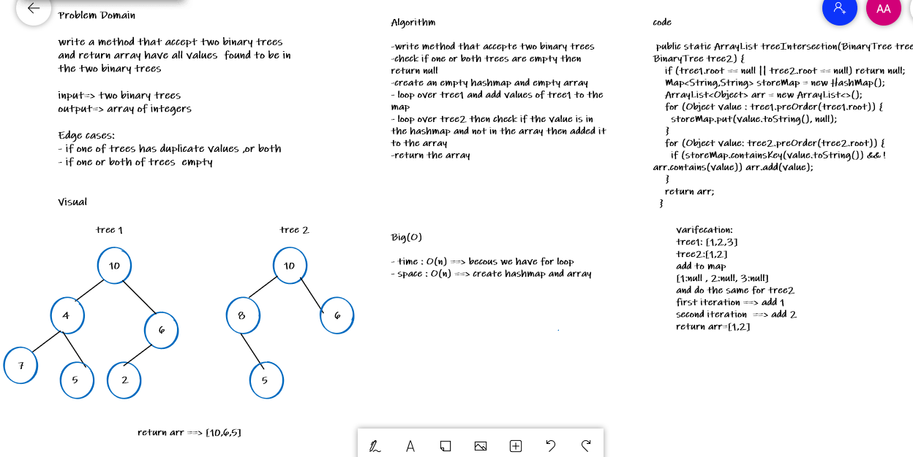

# Challenge Summary
<!-- Description of the challenge -->
write a method that accept two binary trees and return array have all values found to be in the two binary trees

## Whiteboard Process
<!-- Embedded whiteboard image -->

## Approach & Efficiency
<!-- What approach did you take? Why? What is the Big O space/time for this approach? -->
time : O(n) 
space : O(n) 