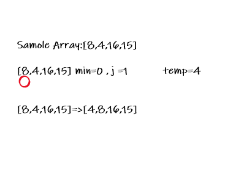
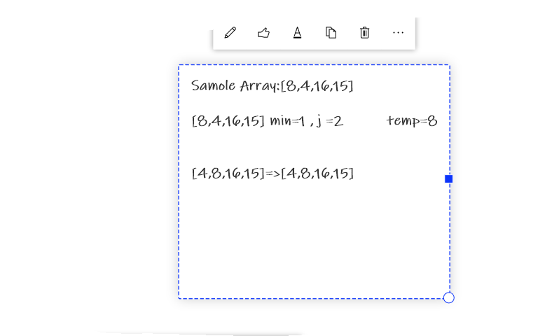
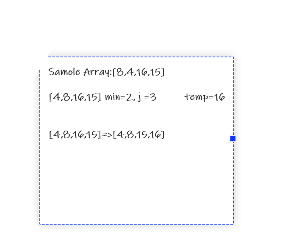
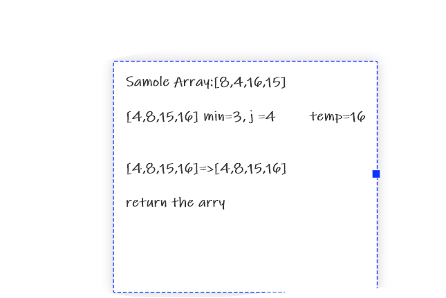

# Insertion Sort

## Pseudocode
`InsertionSort(int[] arr)

    FOR i = 1 to arr.length

      int j <-- i - 1
      int temp <-- arr[i]

      WHILE j >= 0 AND temp < arr[j]
        arr[j + 1] <-- arr[j]
        j <-- j - 1

      arr[j + 1] <-- temp`

-----------------------
> Sample Array: [8,4,16,15]

> Pass 1: min=0; j=1;

> temp=4;

> will compare the 4 with 8, when it's less than 8, will assign it equal to 8 and minus 1 from j to become -1 and break the while loop.

> then assign arr[j+1] the value of temp which is 4.

> Pass 2: min=1; j=1;

> temp=8;

> while temp is == 8 will move to the next iteration.

>Pass 3: min=2; j=3;
temp=16;
while temp is grater than 15 will assign 15 to the previous
> 

> Pass 4: min=3; j=4;
temp=16;
will temp == 16 keep the same
> 

>Efficency
Time: O(n^2)
The basic operation of this algorithm is comparison. This will happen n * (n-1) number of times…concluding the algorithm to be n squared.
Space: O(1)
No additional space is being created. This array is being sorted in place…keeping the space at constant O(1).