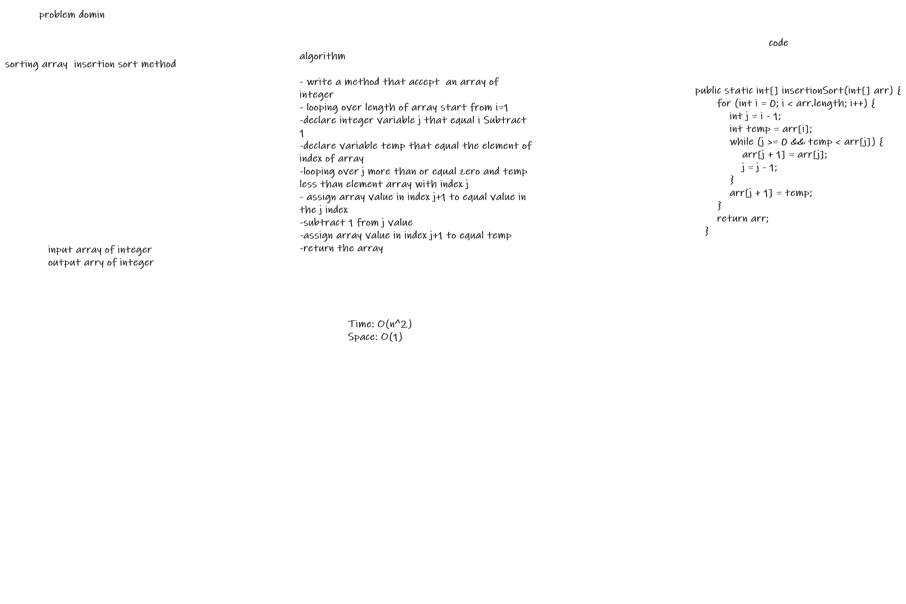

# Challenge Summary
<!-- Description of the challenge -->
create method using the Pseudocode to sort array of numbers.

## Whiteboard Process
<!-- Embedded whiteboard image -->
> 

## Approach & Efficiency
Time: O(n^2)
The basic operation of this algorithm is comparison. This will happen n * (n-1) number of times…concluding the algorithm to be n squared.
Space: O(1)
No additional space is being created. This array is being sorted in place…keeping the space at constant O(1).

[Blog]()
