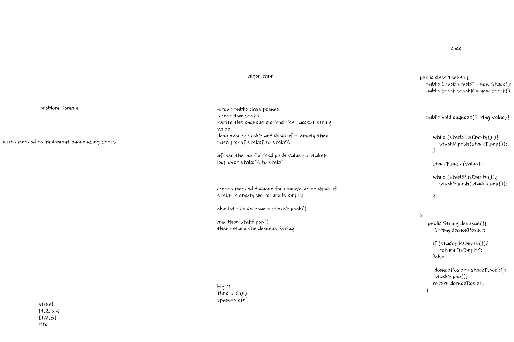

# Challenge Summary
<!-- Description of the challenge -->
write method to implemant queue using Staks

## Whiteboard Process

## Approach & Efficiency
<!-- What approach did you take? Why? What is the Big O space/time for this approach? -->

big O time => O(n),Space => O(N)
